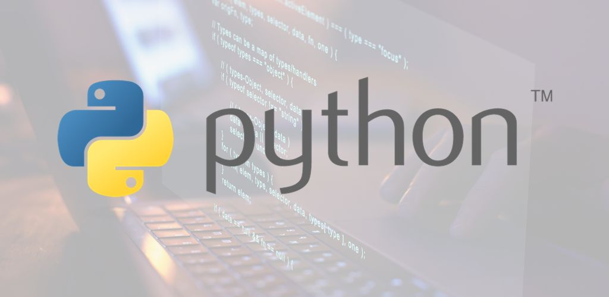

# Repositorio de Material del Curso de Programación 3

## Datos Personales

**Nombre:** Gerardo Ali Ferraro Schelijasch  
**Email:** gerferr83@soltecferr.com  
**Teléfono:** +58 412-0794577  
**GitHub:** [stferraro](https://github.com/stferraro)
 

## Descripción

Este es el repositorio del material del curso de Programación 3.

## Contenido

Unidad I - Fundamentos básicos:

- Introducción 
	- Definición de algoritmo 
	- ¿Que es un programa ?
	- ¿Que es un lenguaje de programación ?
	- Definición de compilador y de interprete.
	- El lenguaje de Programación Python.
	- Primer ejemplo en Python.

Unidad II - Elementos básicos:

- Definición de Variable.
- Definición de Constante.
- Técnicas de Naming.
- Tipos de datos.
	- Numéricos.
		- Enteros.
		- Flotantes o reales
		- Complejos
	- Booleanos
	- Cadena de caracteres
- Operadores
	- Operadores aritméticos.
	- Operadores relacionales.
	- Operadores lógicos.
	- Operadores de asignación
- Comentarios.
- UML.

Unidad VI - Colecciones:

- Definición 
- Colecciones en Python
	- Listas
	- Tuplas
	- Diccionarios
- Usos y generalidades.

Unidad V - Cadena de Caracteres:

- Cadena de caracteres 
- Indexación
- Slicing
- Métodos
	- capitalize() 
	- lower()
	- upper()
	- strip()
	- replace()
	- swapcase()
	- count()
	- isalnum()
	- isalpha()
	- zfill()
	- split()

Unidad VI - Ciclos o bucles

- Las estructuras repetitivas
- Definición
- Uso
- Ciclo while
- Ciclo for
- Ejercicios y ejemplos

Unidad VII - Funciones

- Definición
- Algoritmo de Divide et impera(Divide y Vencerás)
- Funciones en Python
	- Uso y generalidades
	- Características
	- Cuerpo de una función
	- Parametros 
	- Uso del return

